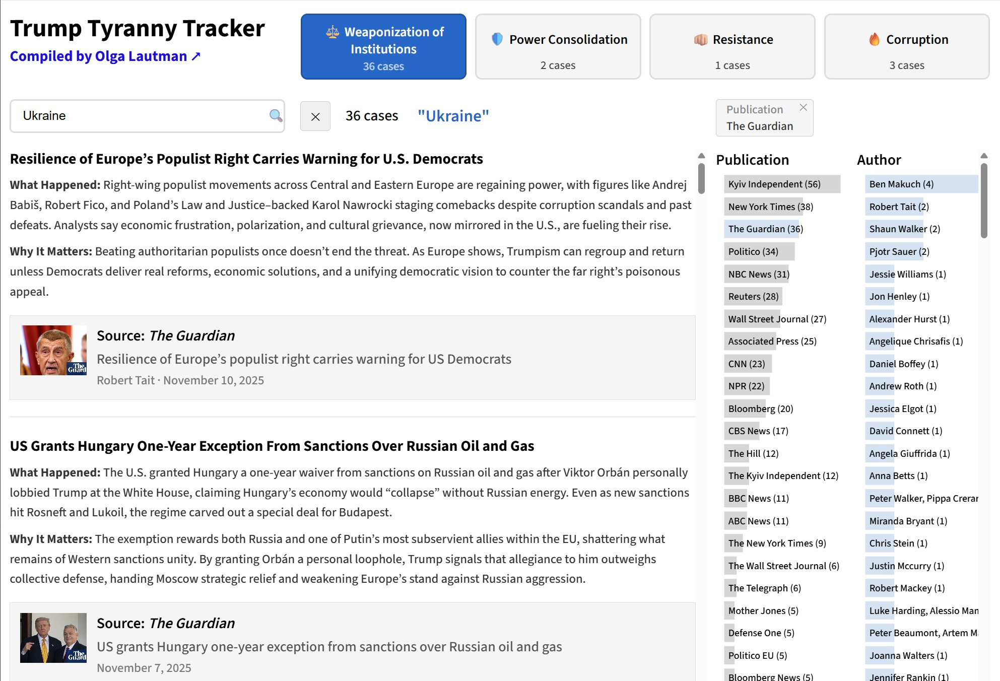

# Trump Tyranny Tracker Explorer

## [Visit Live Site](https://smckissock.github.io/trump-tyranny-tracker/)

An interactive tool for exploring and searching the news stories documented by **[Olga Lautman's Trump Tyranny Tracker](https://trumptyrannytracker.substack.com/)**.

---

## 📰 About Trump Tyranny Tracker

**[Trump Tyranny Tracker](https://trumptyrannytracker.substack.com/)** is a daily newsletter by journalist and analyst **Olga Lautman** that tracks and documents the Trump administration's actions across four key areas:

- ⚖️ **Weaponization of Institutions** — How government agencies are being used against political opponents
- 🛡️ **Power Consolidation** — Efforts to concentrate executive power and weaken checks and balances  
- 👊🏼 **Resistance** — Pushback from courts, states, activists, and citizens
- 🔥 **Corruption** — Self-dealing, conflicts of interest, and abuse of office

Each story includes **what happened** and **why it matters**, providing essential context for understanding the news.

---

## 🔍 What This Tool Does

This explorer provides an interactive way to browse and search the thousands of stories documented in the Trump Tyranny Tracker:

- **Browse by category** — Filter stories by the four main news categories
- **Search by topic** — Find stories about specific people, organizations, or places
- **Filter by publication** — See coverage from specific news sources
- **Filter by author** — Find stories by specific journalists

---

## 🔗 Subscribe to the Newsletter

For daily updates, subscribe to the original newsletter:

**👉 [trumptyrannytracker.substack.com](https://trumptyrannytracker.substack.com/)**

---

*This tool is an unofficial companion to Olga Lautman's Trump Tyranny Tracker newsletter.*
